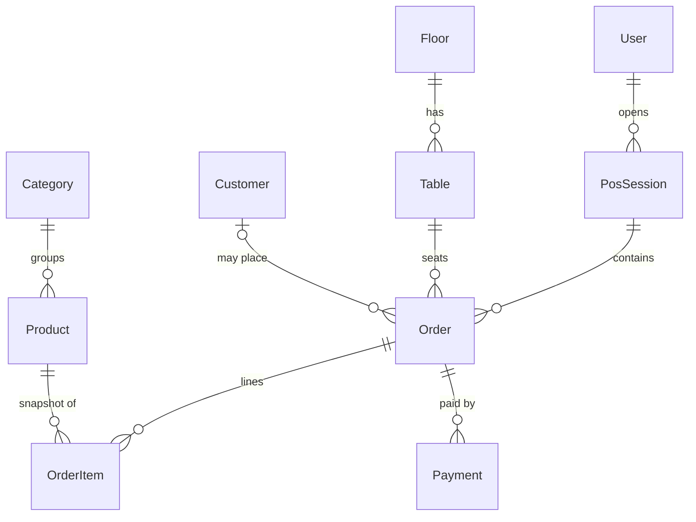

# Architecture

Running doc. Keep the overview current; append to the Decision Log — never rewrite history.

## Overview

Hackathon project on **Next.js 16 (App Router)** + **React 19** + **TypeScript** + **Tailwind CSS**, package-managed with **pnpm**. No deploy — the demo runs locally.

### Stack

| Layer | Choice | Notes |
|-------|--------|-------|
| Framework | Next.js 16 (App Router) | Server Components by default |
| UI | React 19 + Tailwind | client components only when needed |
| Language | TypeScript (strict) | |
| Package manager | pnpm | lockfile `pnpm-lock.yaml` |
| Hosting | Local (no deploy) | demo runs on a laptop; `main` = source of truth |
| Database | PostgreSQL (Neon, likely) | hosted; connection via `DATABASE_URL` |
| ORM | Prisma 7 | engine-less, `@prisma/adapter-pg` driver adapter |

### Structure

- `src/app/` — routes (`page.tsx`), layouts, and API route handlers (`src/app/api/.../route.ts`).
- `docs/apis/` — one doc per route, mirroring the route path.
- `docs/seed/` — seed/fixture state Claude tests against.
- Data flows: Server Component / Server Action fetches data → renders. Client components are leaf-level and interactive-only.

## Data Model

> Mentors quiz the DB design in judging. Keep this current with `prisma/schema.prisma` and
> be ready to defend *why* it's shaped this way (keys, relationships, normalization).

**Entities & relationships:**

| Model | Key fields | Relationships | Why |
|-------|-----------|---------------|-----|
| `User` | `id`, `email`, `role` | has many `Account`, `Session`, `PosSession` | Auth.js identity + POS role (ADMIN/EMPLOYEE) |
| `Account` / `Session` / `VerificationToken` | — | belong to `User` | Auth.js adapter tables |
| `Category` | `name`, `color` | has many `Product` | menu grouping; color drives POS tabs/cards |
| `Product` | `name`, `price`, `tax`, `unit`, `sendToKitchen` | belongs to `Category`, has many `OrderItem` | menu item; `sendToKitchen` gates KDS visibility |
| `Floor` | `name` | has many `Table` | floor plan |
| `Table` | `number`, `seats`, `active` | belongs to `Floor`, has many `Order` | floor pop-up; `@@unique([floorId, number])` |
| `Customer` | `name`, `email`, `phone` | has many `Order` | optional; receipt email |
| `PosSession` | `openedAt`, `closedAt` | belongs to `User`, has many `Order` | a cashier's shift; groups orders for reports |
| `Order` | `number`, `status`, `kitchenStatus`, `subtotal`/`tax`/`discount`/`total` | belongs to `Table`, `Customer?`, `PosSession`; has many `OrderItem`, `Payment` | central entity + A↔B shared contract |
| `OrderItem` | `name`, `unitPrice`, `qty`, `lineTotal` | belongs to `Order`, `Product` | line **snapshot** (price frozen at add-time) |
| `Payment` | `method`, `amount`, `reference?`, `changeDue?` | belongs to `Order` | Cash/Card/UPI (Card+UPI simulated in MVP) |
| `PaymentMethodSetting` | `method` (PK), `enabled`, `upiId?`, `label?` | — (one row per `PaymentMethod`) | admin toggles which methods the POS offers; UPI id → QR |

**Enums:** `Role` (ADMIN, EMPLOYEE) · `OrderStatus` (DRAFT→PAID→CANCELLED) · `KitchenStatus` (NONE→TO_COOK→PREPARING→COMPLETED) · `PaymentMethod` (CASH, CARD, UPI).

**Defensible design choices (mentor prep):**
1. **`OrderItem` snapshots `name`+`unitPrice`** — editing a `Product`'s price later must not rewrite historical orders/receipts.
2. **Two independent statuses on `Order`** — `status` is the payment lifecycle, `kitchenStatus` is cooking progress; an order can be `PREPARING` while still `DRAFT`/unpaid. Cleanly separates the cashier flow (Rajat) from the kitchen flow (Mukund).
3. **Money as `Decimal(10,2)`**, never float — avoids rounding errors at checkout/tax.
4. **`PosSession`** groups a shift's orders → powers the "last session" panel and the reporting dashboard add-on.
5. Indexes on FK + `Order.status` for the POS list/KDS queries.

## Decision Log

Format: **date — decision — why — alternatives rejected.**

- **2026-06-12 — pnpm over npm/yarn.** Fast, disk-efficient, strict node_modules. Rejected: npm (slower, flat deps).
- **2026-06-12 — Next.js 16 App Router.** Server Components + Server Actions reduce API surface; full-stack in one repo. Rejected: Pages Router (legacy), separate SPA+API (more glue).
- **2026-06-12 — PostgreSQL + Prisma 7.** Postgres on Neon (hosted, free tier, no local docker). Prisma for type-safe queries + built-in migrations/seed; Claude knows it well, `schema.prisma` self-documents. Prisma 7 is engine-less → requires a driver adapter (`@prisma/adapter-pg` over `pg`). Shared client singleton in `src/lib/db.ts` to survive Next hot-reload. Migrations in `prisma/migrations/` (committed), seed in `prisma/seed.ts`. Rejected: Drizzle (lighter but Claude less reliable), raw SQL (no type safety). **Caveat:** serverless + Prisma needs connection pooling — use Neon's pooled URL (`-pooler` host); revisit Accelerate/PgBouncer if we hit connection limits.
- **2026-06-12 — Docs live with code.** API doc per route under `docs/apis/`, single ARCHITECTURE.md, seed state in `docs/seed/`. Enforced by a blocking `pre-push` hook (route changed without doc → push rejected). Why: Claude writes/runs tests against documented contracts; drift = false test failures. Rejected: no docs (Claude reverse-engineers contracts), pre-commit hook (nags every commit).
- **2026-06-13 — Branch flow `feat|fix|chore|docs|refactor/* → dev → main`.** Features PR into `dev` (Copilot auto-reviews on push); `dev → main` is a promotion PR at demo checkpoints (merge commit, not squash, to keep history readable). Both branches protected by active rulesets (PR required, no direct push / force-push / deletion). Why: keep `main` always demo-ready while batching review on `dev`; promotion PR stays readable without re-reviewing. Rejected: `feat/* → main` directly (no integration staging), funneling everything through `dev` with squash (giant unreviewable promotion diff).
- **2026-06-13 — Email/password auth (primary) + Google (secondary), JWT sessions.** The brief (§2.1) specifies Name/Email/Password signup + Email/Password login, so we added an Auth.js Credentials provider (bcrypt hash in `User.passwordHash`) as the primary login, kept Google OAuth as a secondary option, and switched the session strategy from **database → JWT**. Why JWT: the Credentials provider cannot use database sessions (Auth.js writes no `Session` row for it), so JWT is mandatory once Credentials is present; Google works on JWT too. Signup via `POST /api/signup`. The `Session` table is now unused (kept for the adapter / future OAuth). `requireUser`/`requireRole` unchanged — role now rides the JWT. Rejected: Google-only (diverges from the brief, needs creds to even log in), database sessions (incompatible with Credentials), rolling our own auth (Auth.js is already wired).
- **2026-06-13 — Admin backend (Phase 2): Booking + Payment Methods + Users.** Added `PaymentMethodSetting` (one row per method: `enabled`, `upiId`, `label`) + `User.active`. Payment methods: admin toggles drive a POS-facing `GET /api/payment-methods` (enabled only) that the checkout consumes; the payment route also rejects a disabled method server-side (409). UPI QR is rendered client-side with **`qrcode.react`** from the saved `upiId` (`upi://pay?pa=…&am=…&cu=INR`) — no network, offline-safe. Floors/tables CRUD with the established archive (tables w/ orders)/restrict (floors w/ tables) policy. Users: create/role/password/archive/delete with guards — can't archive/delete/demote **yourself** or the **last active ADMIN** (`src/lib/admin-guards.ts`); archived users blocked at login (`auth.ts` `authorize` `active` check). Rejected: a single JSON `AppSettings` blob (per-method rows are cleaner for the toggle UI + the enabled-only query); a QR image API (network dependency breaks the offline demo). Schema-touching → Migration B (`PaymentMethodSetting`, `User.active`).
- **2026-06-13 — Admin backend (Phase 0–1): role-gated `/admin`, lightweight validators, archive-on-delete.** Built the missing third surface (the "User"/admin role). AuthZ: admin write/read routes call `requireRole("ADMIN")` (first real use of the helper); `src/app/admin/layout.tsx` is a Server Component that `auth()`-checks the role and redirects (the proxy stays cookie-only and can't read the role). Validation: added `src/lib/validate.ts` (tiny inline guards: `str/int/decimalStr/bool/oneOf/optional`) instead of adopting zod mid-codebase — matches the existing inline-throw style. Errors: `errorResponse` now maps Prisma `P2002`→409 and `P2025`→404 centrally; `ApiError` moved to `src/lib/api-error.ts` (dep-free) so validators/tests don't pull the server auth stack. Delete policy: products referenced by `OrderItem` → **archive** (`active=false`) to preserve history; categories with products → **restrict** (409). Routes under `/api/admin/...`; UI under `src/app/admin/...` reusing the reducer-hook + shadcn pattern. POS stays open to ADMIN+EMPLOYEE. Rejected: zod (churn across ~9 routes), hard-deleting referenced products (breaks order history/receipts), putting role checks in the proxy (edge can't decode the JWT by our design). Schema-touching admin pieces (payment-method settings, coupons, promotions) are deferred to later phases (need Vaibhav migrations).
- **2026-06-13 — One open DRAFT order per table (resume, don't duplicate).** Selecting a table loads its existing DRAFT order (`GET /api/orders?tableId=&status=DRAFT`) into the cart; cashier actions (Send to Kitchen / Pay) **create-or-update** that one draft (`ensureOrder` → POST if none, else PATCH) instead of creating a new order each time. Why: fixes three coupled problems — orders not persisting across navigation, duplicate drafts per table, and tables that wouldn't free (a table is "occupied" iff it has a DRAFT order, so duplicates pinned it). Now occupancy is clean: occupied while the single draft is open, free once PAID. Also closes the order-creation idempotency hole (retries/double-clicks reuse the draft). Rejected: idempotency-key header (more moving parts), auto-saving the draft on every cart keystroke (write-heavy, race-prone) — we persist on explicit actions instead. Open follow-up: a Cancel action (→ CANCELLED) to vacate an abandoned table without paying.
- **2026-06-13 — Cafe POS data model.** Added domain models (Category, Product, Floor, Table, Customer, PosSession, Order, OrderItem, Payment) + enums. Key calls: `OrderItem` snapshots name/price (history immutable to product edits); `Order` carries separate `status` (payment) and `kitchenStatus` (cooking) so cashier and kitchen flows decouple; money is `Decimal(10,2)` not float; `Product.sendToKitchen` gates KDS visibility. Rejected: line items referencing live product price (breaks past receipts), single combined status field (couples unrelated flows), float money (rounding bugs).
- **2026-06-13 — Enforcement moved from local `pre-push` hook to CI.** Deleted `.husky/pre-push`; the typecheck and API-doc-sync gates now run as CI jobs on every PR into `dev`/`main` (`doc-sync` job + lint/typecheck/build). Why: a slow local typecheck on every push hurt sprint speed, and CI-on-PR is the real merge gate now that branches are PR-protected. Trade-off: contributors can push a broken commit to their own feature branch (caught at the PR, not the push). Rejected: keeping the pre-push hook (per-push latency), dropping doc-sync entirely (loses the documented-contract guarantee).
- **2026-06-13 — Concurrency model: app-layer CAS guards + DB constraints (not RLS).** A robustness audit found several invariants enforced only in app code with a read-then-write window under Postgres' default **Read Committed** isolation. Fixes, two layers: **(1) app guards** — `PATCH /api/orders/[id]` re-asserts DRAFT inside the transaction via `updateMany({where:{id,status:"DRAFT"}})` (compare-and-swap, the same pattern the payment route already used) and blocks item edits once `kitchenStatus !== "NONE"`; payment is scoped to the cashier's open session; discount is capped at `subtotal + tax`; the admin last-admin / last-payment-method guards now run inside a transaction with `SELECT … FOR UPDATE` on the active-admin / enabled-method rows so two concurrent calls serialize instead of both passing the check. **(2) DB constraints** (migration `20260613161000_concurrency_constraints`, Vaibhav-applied) — partial-unique `Order(tableId) WHERE status='DRAFT'` (one open order per table; also makes `POST /api/orders` idempotent per table → P2002→409 "table already has an open order"), partial-unique `PosSession(userId) WHERE closedAt IS NULL` (one open till per cashier; `getOpenPosSession` catches P2002 and reads the winner), and CHECK constraints (`discount ≤ subtotal+tax`, `tax ≥ 0`, `payment.amount > 0`). Why both: app guards give friendly errors on the hot path, constraints are the net that holds regardless of which request races or even a direct SQL write. Note `Prisma.Decimal` can't be partial-unique/CHECK in `schema.prisma`, so these live in raw migration SQL. Rejected: `Serializable` isolation everywhere (retry-on-abort plumbing + Neon pooler caveats for low-frequency races — `FOR UPDATE` is local + deterministic); a generic Idempotency-Key table (the table *is* the natural dedupe key for orders). Known-deferred: a `KITCHEN` role for the KDS surface, a least-privilege runtime DB role, and a CI migrate-drift gate.
- **2026-06-13 — Floor-shared tables (orders belong to the table, not the cashier).** A POS order is a property of the **table**, not the session that opened it: any employee can list, edit, and pay any table's open order. The order's `sessionId` is kept as **provenance** (which till opened it, for Z-report/reconciliation), not as an access boundary. Implemented by removing the `sessionId` filter from `GET /api/orders`, `PATCH /api/orders/[id]`, and `POST /api/orders/[id]/payment` (lookups are now by id / table only). Why: this is how a cafe floor actually runs — waiters/cashiers are interchangeable, one bill per table, whoever's free serves it; it also resolves a latent inconsistency where table **occupancy** was computed globally (`GET /api/tables` counts DRAFT orders with no session filter) while order **access** was session-private, which dead-ended a second cashier on a 409. The single-DRAFT-per-table index (above) now cleanly expresses "one shared bill per table." Rejected: session-private ownership (a table owned by one till, others get "in use on another register") — more code, fine-dining semantics, not what an Odoo cafe POS wants; this also intentionally supersedes the earlier "scope payment to the cashier's session" guard, which was enforcing the wrong tenancy model. Concurrency guards (DRAFT-only, kitchen-edit lock, CAS on edit, single-payment CAS) are unchanged — they key on order state, not session.
- **2026-06-14 — Self-checkout kiosk (Receipt delivery add-on, no schema change).** Added a public, unauthenticated `/self-checkout` flow: guest browses the menu, picks a free table, enters an email, and places a DRAFT order with no payment (cashier collects payment at the table as usual). Items are created at `round: 1, kitchenStatus: "TO_COOK"` so they hit the kitchen immediately — no cashier "Send to Kitchen" step. A receipt (items + total due) is emailed via `src/lib/mailer.ts` (nodemailer, SMTP host/port/user/pass/from from env; logs instead of sending if `SMTP_HOST` is unset — dev-safe). Three new routes (`GET /api/self-checkout/menu`, `GET /api/self-checkout/tables`, `POST /api/self-checkout`) skip `requireUser`/`requireEmployee`; `src/proxy.ts` excludes `/self-checkout` from the login redirect. **Order.sessionId is required** (owned by a `User`'s `PosSession`) — rather than a schema change (nullable FK, needs Vaibhav + a shared-DB migration), self-checkout orders attach to a seeded **kiosk system user** (`kiosk@cafe.internal`, one permanently-open `PosSession`, see `src/lib/kiosk.ts` + `prisma/seed.ts`). `Customer.name` (required, no schema change) is set to the guest's email since the kiosk only collects email. Occupancy reuses the existing "one DRAFT order per table" partial-unique index — a guest can only pick a currently-free table, re-checked server-side (409 on race). Rejected: nullable `sessionId` (schema-owner-gated, slower), collecting a guest name (not in the requested flow), making self-checkout items unfired round-0 (defeats "no cashier needed" — but then nothing reaches the kitchen until staff notice).
- **2026-06-13 — RLS N/A — single-tenant, single DB role.** No Row-Level Security, by decision. RLS isolates *different owners'* rows when the database is reached by *multiple* DB principals; this app is **one cafe** (one tenant — every row belongs to the same owner) reached by **one** Postgres role (the single `DATABASE_URL` credential — all staff, every screen, hit the DB as that one role). Many *app* users (`User` rows, `ADMIN`/`EMPLOYEE`) is an application-layer fact handled by `requireRole`/`requireEmployee`, not a DB-role or tenancy fact. So the access control we need is **authorization** (app-enforced, done) and the integrity net is **constraints** (above) — RLS would re-implement `requireRole` in SQL for zero isolation benefit. This flips only if the product goes **multi-cafe in one DB** (add `cafeId` to every table + an RLS policy keyed on a per-request session var). Rejected: enabling RLS now (complexity, no benefit at one tenant/one role).
