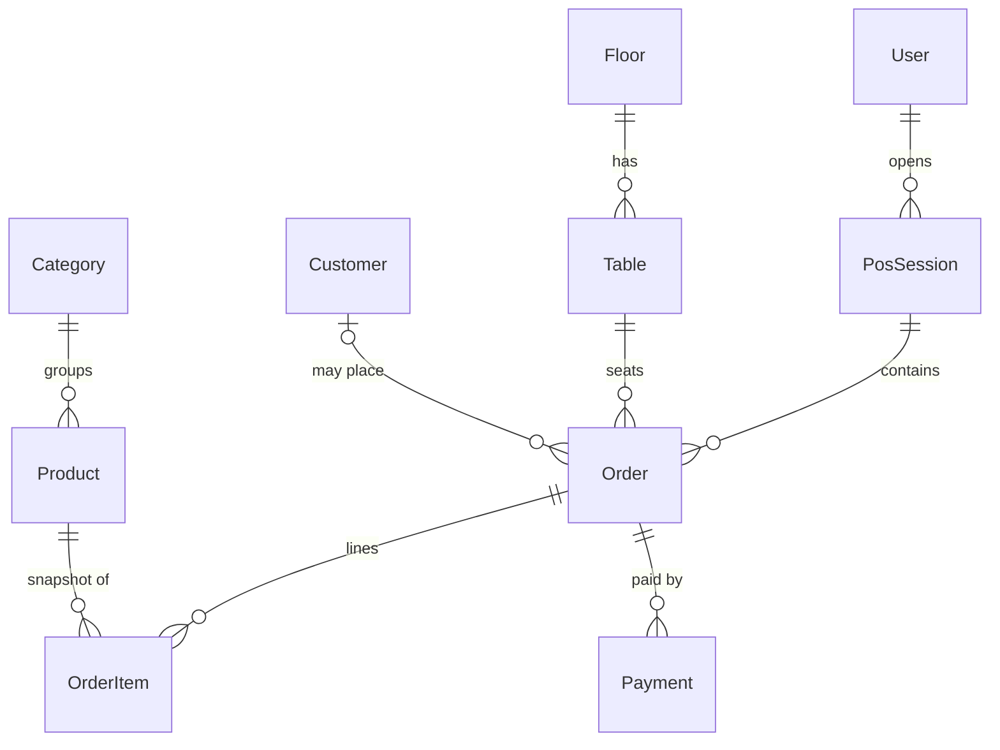

# Architecture

Running doc. Keep the overview current; append to the Decision Log — never rewrite history.

## Overview

Hackathon project on **Next.js 16 (App Router)** + **React 19** + **TypeScript** + **Tailwind CSS**, package-managed with **pnpm**. No deploy — the demo runs locally.

### Stack

| Layer | Choice | Notes |
|-------|--------|-------|
| Framework | Next.js 16 (App Router) | Server Components by default |
| UI | React 19 + Tailwind | client components only when needed |
| Language | TypeScript (strict) | |
| Package manager | pnpm | lockfile `pnpm-lock.yaml` |
| Hosting | Local (no deploy) | demo runs on a laptop; `main` = source of truth |
| Database | PostgreSQL (Neon, likely) | hosted; connection via `DATABASE_URL` |
| ORM | Prisma 7 | engine-less, `@prisma/adapter-pg` driver adapter |

### Structure

- `src/app/` — routes (`page.tsx`), layouts, and API route handlers (`src/app/api/.../route.ts`).
- `docs/apis/` — one doc per route, mirroring the route path.
- `docs/seed/` — seed/fixture state Claude tests against.
- Data flows: Server Component / Server Action fetches data → renders. Client components are leaf-level and interactive-only.

## Data Model

> Mentors quiz the DB design in judging. Keep this current with `prisma/schema.prisma` and
> be ready to defend *why* it's shaped this way (keys, relationships, normalization).

**Entities & relationships:**

| Model | Key fields | Relationships | Why |
|-------|-----------|---------------|-----|
| `User` | `id`, `email`, `role` | has many `Account`, `Session`, `PosSession` | Auth.js identity + POS role (ADMIN/EMPLOYEE) |
| `Account` / `Session` / `VerificationToken` | — | belong to `User` | Auth.js adapter tables |
| `Category` | `name`, `color` | has many `Product` | menu grouping; color drives POS tabs/cards |
| `Product` | `name`, `price`, `tax`, `unit`, `sendToKitchen` | belongs to `Category`, has many `OrderItem` | menu item; `sendToKitchen` gates KDS visibility |
| `Floor` | `name` | has many `Table` | floor plan |
| `Table` | `number`, `seats`, `active` | belongs to `Floor`, has many `Order` | floor pop-up; `@@unique([floorId, number])` |
| `Customer` | `name`, `email`, `phone` | has many `Order` | optional; receipt email |
| `PosSession` | `openedAt`, `closedAt` | belongs to `User`, has many `Order` | a cashier's shift; groups orders for reports |
| `Order` | `number`, `status`, `kitchenStatus`, `subtotal`/`tax`/`discount`/`total` | belongs to `Table`, `Customer?`, `PosSession`; has many `OrderItem`, `Payment` | central entity + A↔B shared contract |
| `OrderItem` | `name`, `unitPrice`, `qty`, `lineTotal` | belongs to `Order`, `Product` | line **snapshot** (price frozen at add-time) |
| `Payment` | `method`, `amount`, `reference?`, `changeDue?` | belongs to `Order` | Cash/Card/UPI (Card+UPI simulated in MVP) |

**Enums:** `Role` (ADMIN, EMPLOYEE) · `OrderStatus` (DRAFT→PAID→CANCELLED) · `KitchenStatus` (NONE→TO_COOK→PREPARING→COMPLETED) · `PaymentMethod` (CASH, CARD, UPI).

**Defensible design choices (mentor prep):**
1. **`OrderItem` snapshots `name`+`unitPrice`** — editing a `Product`'s price later must not rewrite historical orders/receipts.
2. **Two independent statuses on `Order`** — `status` is the payment lifecycle, `kitchenStatus` is cooking progress; an order can be `PREPARING` while still `DRAFT`/unpaid. Cleanly separates the cashier flow (Rajat) from the kitchen flow (Mukund).
3. **Money as `Decimal(10,2)`**, never float — avoids rounding errors at checkout/tax.
4. **`PosSession`** groups a shift's orders → powers the "last session" panel and the reporting dashboard add-on.
5. Indexes on FK + `Order.status` for the POS list/KDS queries.

## Decision Log

Format: **date — decision — why — alternatives rejected.**

- **2026-06-12 — pnpm over npm/yarn.** Fast, disk-efficient, strict node_modules. Rejected: npm (slower, flat deps).
- **2026-06-12 — Next.js 16 App Router.** Server Components + Server Actions reduce API surface; full-stack in one repo. Rejected: Pages Router (legacy), separate SPA+API (more glue).
- **2026-06-12 — PostgreSQL + Prisma 7.** Postgres on Neon (hosted, free tier, no local docker). Prisma for type-safe queries + built-in migrations/seed; Claude knows it well, `schema.prisma` self-documents. Prisma 7 is engine-less → requires a driver adapter (`@prisma/adapter-pg` over `pg`). Shared client singleton in `src/lib/db.ts` to survive Next hot-reload. Migrations in `prisma/migrations/` (committed), seed in `prisma/seed.ts`. Rejected: Drizzle (lighter but Claude less reliable), raw SQL (no type safety). **Caveat:** serverless + Prisma needs connection pooling — use Neon's pooled URL (`-pooler` host); revisit Accelerate/PgBouncer if we hit connection limits.
- **2026-06-12 — Docs live with code.** API doc per route under `docs/apis/`, single ARCHITECTURE.md, seed state in `docs/seed/`. Enforced by a blocking `pre-push` hook (route changed without doc → push rejected). Why: Claude writes/runs tests against documented contracts; drift = false test failures. Rejected: no docs (Claude reverse-engineers contracts), pre-commit hook (nags every commit).
- **2026-06-13 — Branch flow `feat|fix|chore|docs|refactor/* → dev → main`.** Features PR into `dev` (Copilot auto-reviews on push); `dev → main` is a promotion PR at demo checkpoints (merge commit, not squash, to keep history readable). Both branches protected by active rulesets (PR required, no direct push / force-push / deletion). Why: keep `main` always demo-ready while batching review on `dev`; promotion PR stays readable without re-reviewing. Rejected: `feat/* → main` directly (no integration staging), funneling everything through `dev` with squash (giant unreviewable promotion diff).
- **2026-06-13 — Cafe POS data model.** Added domain models (Category, Product, Floor, Table, Customer, PosSession, Order, OrderItem, Payment) + enums. Key calls: `OrderItem` snapshots name/price (history immutable to product edits); `Order` carries separate `status` (payment) and `kitchenStatus` (cooking) so cashier and kitchen flows decouple; money is `Decimal(10,2)` not float; `Product.sendToKitchen` gates KDS visibility. Rejected: line items referencing live product price (breaks past receipts), single combined status field (couples unrelated flows), float money (rounding bugs).
- **2026-06-13 — Enforcement moved from local `pre-push` hook to CI.** Deleted `.husky/pre-push`; the typecheck and API-doc-sync gates now run as CI jobs on every PR into `dev`/`main` (`doc-sync` job + lint/typecheck/build). Why: a slow local typecheck on every push hurt sprint speed, and CI-on-PR is the real merge gate now that branches are PR-protected. Trade-off: contributors can push a broken commit to their own feature branch (caught at the PR, not the push). Rejected: keeping the pre-push hook (per-push latency), dropping doc-sync entirely (loses the documented-contract guarantee).
