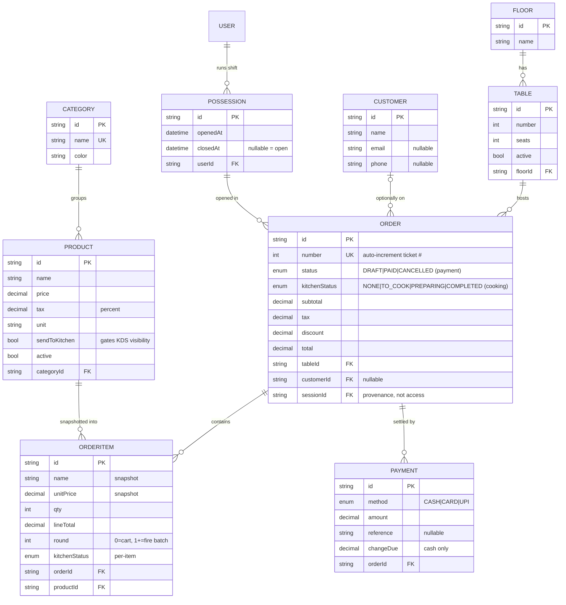
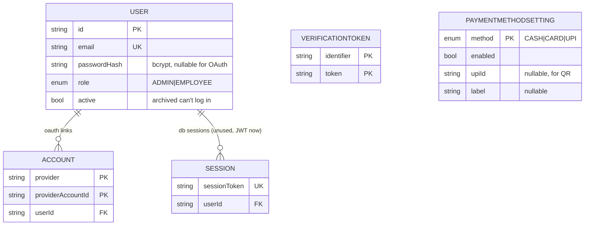

# Migrations, Schema & ER Diagrams — mentor Q&A prep

How our database schema is defined, how it evolved through migrations, the entity-relationship
diagrams, and the questions a mentor is likely to ask about the data model.

> Source of truth: [`prisma/schema.prisma`](../prisma/schema.prisma). Migration SQL:
> [`prisma/migrations/`](../prisma/migrations/). Deeper rationale: [`ARCHITECTURE.md`](./ARCHITECTURE.md).
> Stack-level Q&A: [`stack.md`](./stack.md).

---

## 1. How migrations work here (Prisma)

The flow: **edit `schema.prisma` → generate a migration (a versioned `.sql` diff) → commit it →
apply it.** Migrations are append-only history — we never rewrite an applied one.

- `prisma/migrations/<timestamp>_<name>/migration.sql` — one folder per migration, committed to git.
- `migration_lock.toml` — pins the provider (postgresql).
- **`prisma migrate deploy`** applies *pending* migrations only, never resets — **this is what we run
  on the shared Neon DB**, and only the schema owner (Vaibhav) runs it.
- **`prisma migrate dev`** (= `pnpm db:migrate`) is local-only and **can reset the DB** on drift — we
  do **not** run it against the shared DB.
- Some objects can't be expressed in `schema.prisma` (partial-unique indexes, `CHECK` constraints),
  so those live as **hand-written raw SQL inside the migration file**.
- Seed data: `prisma/seed.ts` (`pnpm db:seed`, idempotent) — documented in [`seed/README.md`](./seed/README.md).

---

## 2. Migration history (what each one did, and why)

| # | Migration | Added | Why |
|---|---|---|---|
| 1 | `…_init` | Auth.js tables (`User`, `Account`, `Session`, `VerificationToken`) + `Role` enum | Baseline auth scaffold for `@auth/prisma-adapter`. |
| 2 | `…_pos_cafe` | Domain models: `Category`, `Product`, `Floor`, `Table`, `Customer`, `PosSession`, `Order`, `OrderItem`, `Payment` + enums (`OrderStatus`, `KitchenStatus`, `PaymentMethod`) | The core POS data model. Key calls: OrderItem snapshots name/price; Order carries two independent statuses; money is `Decimal(10,2)`. |
| 3 | `…_email_pass` | `User.passwordHash` (+ related auth fields) | Email/password login (brief §2.1). Credentials provider → switched sessions to JWT. |
| 4 | `…_payment_methods` | `PaymentMethodSetting` (one row per method) + `User.active` | Admin toggles which payment methods the POS offers; UPI stores `upiId` for its QR. `active` lets admins archive staff. |
| 5 | `…_concurrency_constraints` | **Partial-unique indexes** + **CHECK constraints** (raw SQL) | Integrity net under Read-Committed races (see §5). One open order per table, one open till per cashier, no negative totals. |
| 6 | `…_kitchen_rounds` | `OrderItem.round` + `OrderItem.kitchenStatus` (+ index, backfill) | Incremental kitchen rounds — add items to a table after the first send; each fire-batch is its own KDS ticket. |

> Migration 5 is the interesting one to talk about — it's where DB-level invariants live. Migration
> 6 backfills existing rows (`UPDATE OrderItem SET round=1 … WHERE order.kitchenStatus<>'NONE'`).

---

## 3. ER diagram — POS core (the part mentors quiz)

## 4. ER diagram — auth + config (supporting tables)

> `Session` / `VerificationToken` are Auth.js adapter tables; since we use **JWT sessions** (needed
> for the Credentials provider) the `Session` table is effectively unused but kept for the adapter.

---

## 5. Schema design — the calls worth defending

1. **`OrderItem` snapshots `name` + `unitPrice`** (doesn't just FK to `Product`). Editing a product's
   price later must **not** rewrite historical orders/receipts. The `productId` FK is kept for
   reporting, but the printed line is frozen at add-time.
2. **Two independent statuses on `Order`:** `status` (DRAFT/PAID/CANCELLED = payment lifecycle) and
   `kitchenStatus` (NONE/TO_COOK/PREPARING/COMPLETED = cooking). An order can be PREPARING while still
   DRAFT/unpaid. This **decouples the cashier flow from the kitchen flow** — they move independently.
3. **Money is `Decimal(10,2)`**, never float — exact at tax/checkout (floats can't represent 0.10).
4. **`Product.sendToKitchen`** gates KDS visibility — drinks (bar items) don't show on the kitchen
   display; only food does.
5. **A table is "occupied" iff it has a DRAFT order** — no separate occupancy column; occupancy is
   derived. Frees automatically on PAID/CANCELLED.
6. **`Order.sessionId` is provenance, not access** — records which till opened the bill (for
   reconciliation), but any employee can serve any table (floor-shared).
7. **`OrderItem.round`** (0 = in cart, 1+ = fire batch) — supports incremental kitchen rounds; a KDS
   ticket = items sharing `(order, round)`.

### DB-level invariants (migration 5, raw SQL)
- **Partial-unique** `Order(tableId) WHERE status='DRAFT'` → exactly one open order per table (also
  makes order creation idempotent — a racing duplicate hits `P2002` → 409).
- **Partial-unique** `PosSession(userId) WHERE closedAt IS NULL` → one open till per cashier.
- **CHECK**: `discount ≤ subtotal+tax`, `tax ≥ 0`, `payment.amount > 0`.
- Reason these are raw SQL: Prisma's schema can't express partial-unique or CHECK.

---

## 6. Likely mentor questions

- **"Walk me through your data model."** A `Floor` has `Table`s; a `Table` hosts `Order`s; an `Order`
  has `OrderItem`s and `Payment`s; each item references a `Product`, which belongs to a `Category`.
  Orders are opened inside a `PosSession` (a cashier's shift) and optionally tied to a `Customer`.
- **"Why snapshot the item name/price instead of just linking the product?"** So changing a product's
  price tomorrow doesn't alter yesterday's receipts. History must be immutable.
- **"Why two status fields on an order?"** Payment and cooking are independent lifecycles — a paid
  order can still be cooking, an unpaid order can already be in the kitchen. One combined field would
  couple unrelated flows.
- **"How do you know a table is occupied?"** It has a DRAFT order. No redundant column to keep in sync.
- **"How do migrations stay safe on a shared DB?"** Committed, append-only SQL; applied with
  `migrate deploy` (never `migrate dev`, which can reset); owner-only.
- **"How do you stop two open bills on one table / duplicate orders?"** A partial-unique index on
  `Order(tableId) WHERE status='DRAFT'` — the database itself rejects a second open order.
- **"How did you add a column to a live table without losing data?"** Migration 6 added
  `round`/`kitchenStatus` with defaults, then **backfilled** existing fired orders
  (`UPDATE … SET round=1 WHERE kitchenStatus<>'NONE'`) so old data stays consistent.
- **"Normalization?"** Mostly 3NF (products, categories, tables, floors are separate entities);
  the one deliberate denormalization is the `OrderItem` snapshot (name/price duplicated) — for
  history immutability, not by accident.
- **"What happens to order history if you delete a product?"** We don't hard-delete referenced
  products — they're **archived** (`active=false`) so `OrderItem` rows and receipts stay intact.
